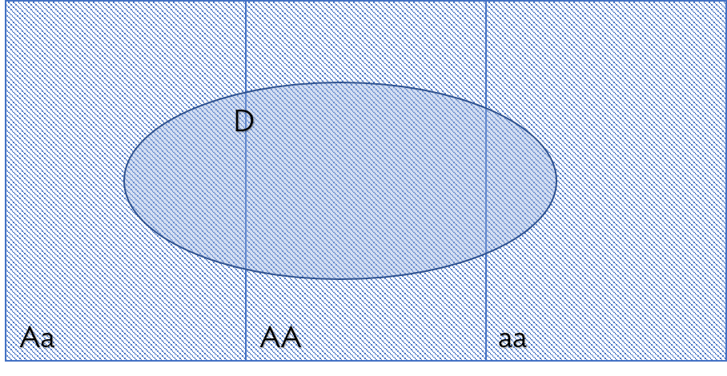

\begin{small}
	
	\textbf{Topics}
	\begin{itemize}
	  \item Definition of conditional probability
	  \item Simulation
	\end{itemize}
	
\end{small}

The previous lab demonstrated the use of \texttt{for} loops to simulate many repetitions of an experiment. This lab illustrates the use of \texttt{if} statements, another element of programming that is helpful when estimating probability via simulation. 

The material in this lab corresponds to Sections 2.2.1 - 2.2.4 of \textit{OpenIntro Biostatistics}.

### Counting successes with \texttt{if} statements

A bag contains 3 red and 3 white balls. Two balls are drawn from the bag, one at a time; the first ball is not replaced before the second ball is drawn.

  1. What is the probability of drawing a white ball on the first pick and a red on the second?
  
    Run the following code to simulate the results for 10 sets of two draws from the bag, where red and white balls are represented by \texttt{R} and \texttt{W}, respectively.
    
    ```{r}
#define parameters
balls = rep(c("R", "W"), c(3,3))
number.draws = 2
replicates = 10

#create empty vector to store results
successes = vector("numeric", replicates)

#set the seed for a pseudo-random sample
set.seed(5011)

#simulate the draws
for(k in 1:replicates){
  
  draw = sample(balls, size = number.draws, replace = FALSE)
  
  if(draw[1] == "W" & draw[2] == "R"){
    successes[k] = 1
  }
  
}

#view the results
successes
table(successes)
```

  a) The \texttt{rep(x, times)} command is a generic way to replicate elements of a vector \texttt{x} a certain number of times. Describe what the vector \texttt{balls} contains, and explain how the code to create the vector could be modified for a bag that contains 5 red balls and 2 white balls.
  
    \textcolor{NavyBlue}{The vector \texttt{balls} contains the elements \texttt{R} and \texttt{W}, each repeated three times; this represents the color and number of balls in the bag. To modify the vector to represent a bag that contains 5 red balls and 2 white balls, change the \texttt{c(3, 3)} to \texttt{c(5, 2)}.}
  
  
  
  
  b) Explain the code used to generate \texttt{draw}.
  
    \textcolor{NavyBlue}{The vector \texttt{draw()} is constructed from randomly sampling the vector \texttt{balls} without replacement; the size of the sample is specified by \texttt{number.draws}, which is set to 2. The \texttt{prob} vector is not specified; by default, \texttt{sample()} chooses elements with equal probability.}
  
  
  
  
  c) An \texttt{if} statement has the basic structure \texttt{if( condition ) \{ statement \} }; if the condition is satisfied, then the statement will be carried out. The \texttt{if} statement in the loop records when a "success" occurs; if a particular replicate $k$ is considered a success, then a \texttt{1} is recorded as the $k^{th}$ element of the vector \texttt{successes}.
  
    Examine the condition in the \texttt{if} statement and explain how the condition specifies when a success occurs. What is considered a success, in the context of this problem?
    
    \textcolor{NavyBlue}{The condition specifies that a \texttt{1} should be recorded in \texttt{successes} only when the first element of \texttt{draw} is a \texttt{W} and the second element is an \texttt{R}. A success is considered a set of two draws where the first draw is a white ball and the second is a red ball.}
    
    
    
    
  d) For these 10 replicates, when did a set of two draws result in a white ball on the first pick and a red on the second?
  
    \textcolor{NavyBlue}{For these 10 replicates, a success occured on the second, fifth, seventh, and eighth picks.}
  
    ```{r}
which(successes == 1)
```
  
  
  
  
  
  
  e) Set the number of replicates to 10,000 and re-run the simulation. What is the estimated probability of drawing a white ball on the first pick and a red on the second?

    \textcolor{NavyBlue}{The estimated probability of drawing a white ball on the first pick and a red on the second is 0.307.}

  
    ```{r}
#define parameters
balls = rep(c("R", "W"), c(3,3))
number.draws = 2
replicates = 10000

#create empty vector to store results
successes = vector("numeric", replicates)

#set the seed for a pseudo-random sample
set.seed(2018)

#simulate the draws
for(k in 1:replicates){
  
  draw = sample(balls, size = number.draws, replace = FALSE)
  
  if(draw[1] == "W" & draw[2] == "R"){
    successes[k] = 1
  }
  
}

#view the results
table(successes)

#estimate the probability
sum(successes)/replicates
```  
  
  
  
  
  f) Using algebraic methods, calculate the probability of drawing a white ball on the first pick and a red on the second. Confirm that the answer matches the one from part e).

    \color{NavyBlue}
    
    Use the multiplication rule of probability for conditional events, $P(A \text{ and } B) = P(B|A) P(A)$. Let $W_1$ be the event that the first ball drawn is white, and $R_2$ be the event that the second ball is red. If a white ball is drawn on the first pick, then there is a $3/5$ chance of drawing a red ball out of the five remaining balls. On the first pick, there is a $1/2$ chance of drawing a white ball.
    
    \[P(W_1 \text{ and } R_2) = P(R_2|W_1)P(W_1) = (3/5)(1/2) = 3/10 \]
    
    This answer is very close to 0.307, the answer from part e).
    
    \color{Black}


\newpage

2. What is the probability of drawing exactly one red ball?

    a) Using algebraic methods, calculate the probability of drawing exactly one red ball.
  
        \color{NavyBlue}

        Out of two picks, there are two ways to draw exactly one red ball: either the red ball is drawn on the first pick (and a white ball on the second), or the red ball is drawn on the second pick (and a white ball on the first). The probability of drawing exactly one red ball is the sum of the probabilities of these two disjoint events.
    
        In Question 1, the probability of the second scenario (red ball second) has already been calculated. Now, calculate the probability of drawing a red ball on the first pick and drawing a white on the second pick. Let $R_1$ represent drawing a red ball on the first pick and $W_2$ the event of drawing a white ball on the second pick:
    
        \[P(R_1 \text{ and } W_2) = P(W_2|R_1)P(R_1) = (3/5)(1/2) = 3/10 \]
        \begin{align*}
        P(\text{exactly one }R) =& P(W_1 \text{ and } R_2) + P(R_1 \text{ and } W_2) \\
        =& P(R_2|W_1)P(W_1) + P(W_2|R_1)P(R_1) \\
        =& (3/5)(1/2) + (3/5)(1/2) \\
        =& 3/5
        \end{align*}
     
        The probability of drawing exactly one red ball equals $3/10 + 3/10 = 3/5$. It makes sense that the probability of drawing red-then-white is equal to the probability of white-then-red, since there is an equal number of red and white balls in the urn.

      \color{Black}
  
  
  
    b) Using simulation, estimate the probability of drawing exactly one red ball. Hint: remember that the logical operator for "or" is the \texttt{|} symbol.
    
        \textcolor{NavyBlue}{The estimated probability of drawing exactly one red ball is 0.60.}
  
    ```{r}
#define parameters
balls = rep(c("R", "W"), c(3,3))
number.draws = 2
replicates = 10000

#create empty vector to store results
successes = vector("numeric", replicates)

#set the seed for a pseudo-random sample
set.seed(2018)

#simulate the draws

for(k in 1:replicates){
  
  draw = sample(balls, size = number.draws, replace = FALSE)
  
  if( (draw[1] == "W" & draw[2] == "R") | (draw[1] == "R" & draw[2] == "W") ){
    successes[k] = 1
  }
}

#view the results
table(successes)

#estimate the probability
sum(successes)/replicates
```  
  
      c) Bonus: How can the condition in the \texttt{if} statement used in part b) be written more simply, so as to directly express the event of drawing exactly one red ball? Hint: use the \texttt{sum()} function.
  
          \textcolor{NavyBlue}{The condition can be written as \texttt{sum(draw == "R") == 1}.}


\newpage

### Simulating a population with \texttt{if} statements

3. In the United States population, approximately 20\% of men and 3\% of women are taller than 6 feet (72 inches). Let $F$ be the event that a person is female and $T$ be the event that a person is taller than 6 feet. Assume that the ratio of males to females in the population is 1:1. 

    Consider the following questions.
    
      - What is the probability that the next person walking through the door is female and taller than 6 feet?
      
      - What is the probability that the next person walking through the door is taller than 6 feet?
      
    One approach to estimating the probabilities is to simulate a large population based on the known information. Essentially, the idea is to randomly assign sex and height status, then count the number of individuals that represent a "successful" outcome.
    
    The code for simulating a population of 10,000 individuals is shown below, with some missing pieces.  Examine the code, then answer the following questions.
    

    ```{r, eval = TRUE}
#define parameters
p.female = 0.50
p.tall.if.female = 0.03
p.tall.if.male = 0.20
population.size = 10000

#create empty vectors to store results
sex = vector("numeric", population.size)
tall = vector("numeric", population.size)

#set the seed for a pseudo-random sample
set.seed(2018)

#assign sex
sex = sample(c(0,1), size = population.size, prob = c(1 - p.female, p.female),
             replace = TRUE)

#assign tall or not
for (k in 1:population.size){
  
  if (sex[k] == 0) {
    tall[k] = sample(c(0,1), prob = c(1 - p.tall.if.male, p.tall.if.male),
                     size = 1, replace = TRUE)
  }
  
  if (sex[k] == 1) {
    tall[k] = sample(c(0,1), prob = c(1 - p.tall.if.female, p.tall.if.female),
                     size = 1, replace = TRUE)
  }
}

#view results
addmargins(table(sex, tall))
```

      a) The first three parameters in the code refer to $P(F)$, $P(T|F)$, and $P(T|M)$, respectively. Identify their values and enter in the parameters.
   
        \textcolor{NavyBlue}{Under the assumption that the ratio of males to females in the population is 1:1, then $P(F) = 0.50$. The probability that someone is tall given they are female is 0.03 and the probability that someone is tall given they are male is 0.20.}
   
   
   
      
      b) The results will be stored in two vectors, \texttt{sex} and \texttt{tall}. Write the code for filling in the \texttt{sex} vector. Let \texttt{0} represent males and \texttt{1} represent females.
   
        \textcolor{NavyBlue}{Use the \texttt{sample} command to sample from \texttt{0} and \texttt{1}, with probabilities $1 - P(F)$ and $P(F)$, respectively. Everyone in the population needs to be assigned a value, so \texttt{size = population.size}. }

      
      c) Explain why filling in the \texttt{tall} vector requires the use of \texttt{if} statements in addition to the \texttt{sample()} command.
  
        \textcolor{NavyBlue}{The probability of being tall is conditional on sex, since the probability of being tall differs by men and women. Using \texttt{if} statements allows for height status to be assigned with the correct probabilities for each sex.}
  
       
      d) Write the code for filling in the \texttt{tall} vector. Let \texttt{0} represent individuals who are not taller than 6 feet and \texttt{1} represent individuals who are taller than 6 feet.
  
        \textcolor{NavyBlue}{Use the \texttt{sample()} command to sample from \texttt{0} and \texttt{1}, with probabilities $1 - P(T|M)$ and $P(M)$ for males and $1 - P(T|F)$ and $P(F)$ for females. The \texttt{for} loop works one individual at a time, so \texttt{size = 1}. }
  
      
      e) Run the simulation and estimate the desired probabilities.
  
        \textcolor{NavyBlue}{The desired probabilities can be calculated from the numbers shown in the table, or from explicitly using \textsf{R}. The estimated probability of being female and taller than 6 feet is 0.017 and the estimated probability of being tall is 0.119.}
  
    ```{r}
#probability of female and tall
sum(tall == 1 & sex == 1)/population.size

#probability of tall
sum(tall)/population.size
```


      f) Using algebraic methods, calculate the desired probabilities. 
  
        \color{NavyBlue}
    
        To calculate $P(F \text{ and } T)$, use the multiplication rule of probability, $P(A \text{ and } B) = P(A|B)P(B)$. 
        \[P(F \text{ and } T) = P(T|F)P(F) = (0.03)(0.50) = 0.015\]
        Note that $P(F \text{ and } T) = P(T|F)P(F) = P(F|T)P(T)$; it is just more convenient to use the version that contains $P(F)$ and $P(T|F)$, since those values are known (from the earlier assumption, and from the problem statement).
    
        To calculate $P(T)$, consider that there are two possible "ways" to be tall: either be a tall female or a tall male. This can be written using probability notation as $P(T) = P(F \text{ and }T) + P(F^{C} \text{ and }T)$.
    
        \begin{align*}
        P(T) =& P(F \text{ and }T) + P(F^{C} \text{ and }T) \\
        =& P(T|F)P(F) + P(T|F^C)P(F^C) \\
        =& (0.03)(0.50) + (0.20)(0.50) \\
        =& 0.115
        \end{align*}

  
  
4. Suppose a disease is caused by a single gene, with alleles $A$ and $a$; the alleles have frequency 0.90 and 0.10, respectively.

    a) Calculate the genotype frequencies for $AA$, $Aa$, and $aa$. Assume independent inheritance of alleles and independent mating.
    
        \color{NavyBlue}

        Under the given assumptions, the multiplication rule can be applied to calculate the genotype frequencies. Let $p$ represent the allele frequency of $A$, and $q$ represent the allele frequency of $a$.

        - The frequency of $AA$ equals $p^{2} = (0.90)^{2} = 0.81$.
        - The frequency of $Aa$ equals $2pq = (2)(0.90)(0.10) = 0.18$. Note that an individual can inherit an $A$ allele from one parent and an $a$ from the other, or vice versa; these are two mutually exclusive events.
        - The frequency of $aa$ equals $q^{2} = (0.10)^{2} = 0.01$.

        \color{Black}

    
    
  
    b) Suppose the disease is not fully penetrant, so that the probability of developing the disease is 0.8 for genotype $AA$, 0.4 for genotype $Aa$, and 0.1 for genotype $aa$. Simulate a population of 10,000 individuals, recording their genotype and disease status. 
    
    ```{r}
#define parameters
p.disease.AA = 0.8
p.disease.Aa = 0.4
p.disease.aa = 0.1

p.AA = 0.81
p.Aa = 0.18
p.aa = 0.01

population.size = 10000

#create empty vectors to store results
genotype = vector("numeric", population.size)
disease = vector("numeric", population.size)

#set the seed for a pseudo-random sample
set.seed(2018)

#assign genotype
genotype = sample(c("AA", "Aa", "aa"), size = population.size,
                  prob = c(p.AA, p.Aa, p.aa), replace = TRUE)

#assign disease status
for(k in 1:population.size){
  
  if(genotype[k] == "AA"){
    disease[k] = sample(c(0, 1), size = 1, 
                      prob = c(1 - p.disease.AA, p.disease.AA),
                      replace = TRUE)
  }

  if(genotype[k] == "Aa"){
    disease[k] = sample(c(0, 1), size = 1, 
                      prob = c(1 - p.disease.Aa, p.disease.Aa),
                      replace = TRUE)
  }

  if(genotype[k] == "aa"){
    disease[k] = sample(c(0, 1), size = 1, 
                      prob = c(1 - p.disease.aa, p.disease.aa),
                      replace = TRUE)
  }
  
}

#view results
addmargins(table(genotype, disease))
```
    
      i. What is the prevalence (overall probability) of disease in the population?
  
          \textcolor{NavyBlue}{The estimated prevalence of disease $P(D)$ is 0.718.}
  
    ```{r}
sum(disease)/population.size
```
  
      
      ii. Given that an individual is known to have the disease, what is the probability they are genotype $AA$? 
  
          \textcolor{NavyBlue}{The estimated probability of being genotype AA given having disease is estimated to be 0.900. To calculate this from the table, divide the number of individuals who have the disease and are genotype AA by the number of individuals with disease: $6464/7182 = 0.900.$}
  
    ```{r}
sum(genotype == "AA" & disease == 1)/sum(disease)
```

      
      iii. Using algebraic methods, confirm your answers to parts i. and ii.
  
          \textcolor{NavyBlue}{Let $D$ represent the event of developing the disease. There are three possible ways to have the disease: be either genotype $AA$, $Aa$, or $aa$.}
  

        ```{r, out.width = "200px", echo = FALSE, fig.align = 'center'}

```

          \color{NavyBlue}

          (part i.) The total probability of developing the disease, $P(D)$, can be calculated by adding together the joint probabilities of having the disease and being a certain genotype; i.e., $P(D \cap AA)$, $P(D \cap Aa)$, and $P(D \cap aa)$.

          The problem statement gives conditional probabilities: $P(D|AA)$, $P(D|Aa)$, and $P(D|aa)$. Use the definition of conditional probability, $P(A|B) = P(A \cap B) / P(B)$ to re-write the joint probabilities:
  
          \begin{align*}
              P(D) =& P(D \cap AA) + P(D \cap Aa) + P(D \cap aa) \\
              =& P(D|AA)P(AA) + P(D|Aa)P(Aa) + P(D|aa)P(aa) \\
              =& (0.8)(0.81) + (0.4)(0.18) + (0.1)(0.01) \\
              =& 0.721
          \end{align*}
  
  
          (part ii.) The probability of interest is $P(AA|D)$. Use the definition of conditional probability:

          \begin{align*}
              P(AA|D) =& \dfrac{P(AA \cap D)}{P(D)} \\
              =& \dfrac{P(D|AA)P(AA)}{P(D)} \\
              =& \dfrac{(0.8)(0.81)}{0.721} \\
              =& 0.899
          \end{align*}

        \color{Black}