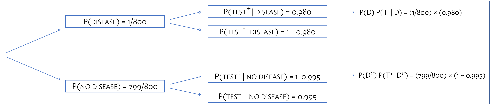

\begin{small}
	
	\textbf{Topics}
	\begin{itemize}
	  \item Positive Predictive Value
	  \item Bayes' Theorem
	  \item Simulation
	\end{itemize}
	
\end{small}

The **positive predictive value (PPV)** of a diagnostic test is the probability that a person has a disease, given that they tested positive for it. This lab illustrates three common approaches for calculating PPV: contingency tables, tree diagrams, and simulation. The last two questions are more concept-oriented and probe the relationships between prevalence, sensitivity, specificity, PPV, and NPV.

The material in this lab corresponds to Section 2.2.5 of *OpenIntro Biostatistics*.


#### Introduction

Suppose a child tests positive for trisomy 21 from a cell-free fetal DNA (cfDNA) test. What is the probability that the child does have trisomy 21, given the positive test result?

This conditional probability, $P(D|T^{+})$, where $D$ is the event of having the disease and $T^{+}$ is the event of a positive test, has a specific name: **positive predictive value (PPV) **. Similarly, the **negative predictive value (NPV)**, $P(D^c|T^{-})$, is the probability that disease is absent when test results are negative. These values are of particular importance to clinicians in assessing patient health.

The characteristics of diagnostic tests are given with the reverse conditional probabilities---the probability that the test correctly returns a positive test in the presence of disease and a negative result in the absence of disease. The probability $P(T^+|D)$ is referred to as the **sensitivity** of the test and $P(T^-|D^c)$ is the **specificity** of the test.\footnote{Note that the sensitivity can also be referred to as the probability of a true positive and the specificity is the probability of a true negative. Thus, the probability of a false negative equals (1 - sensitivity) and the probability of a false positive equals (1 - specificity). } Given these two values and the marginal probability of disease $P(D)$, also known as the **prevalence**, it is possible to calculate both the PPV and NPV of a diagnostic test.
  
  - Sensitivity: Of 1,000 children with trisomy 21, approximately 980 test positive.
  
  - Specificity: Of 1,000 children without trisomy 21, approximately 995 test negative.
  
  - Prevalence: Trisomy 21 occurs with a rate of approximately 1 in 800 births.

There are several possible strategies for approaching this type of calculation: 1) creating a contingency table for a large, hypothetical population, 2) running a simulation, 3) using an algebraic approach with Bayes' Theorem.

\newpage

1. **Table-based approach**. Constructing a contingency table for a large, hypothetical population offers an intuitive way to understand the distribution of disease incidence and test outcome. Suppose that the total population is 100,000. The following table can be filled in based on the known information about disease prevalence, test specificity, and test sensitivity.

    \begin{centering}

    \begin{tabular}{|r|c|c|c|}
		\hline
		& Disease Present & Disease Absent & Sum \\ 
		\hline
		&  &  &  \\
		Test Positive & 122.5 & 499.375 & 621.875 \\
		 &  &  &  \\
		\hline
		&  &  &  \\
		Test Negative & 2.5 & 99,375.62 & 99,378.12\\ 
		&  &  &  \\
		\hline
		&  &  &  \\
		Sum & 125 & 99,875 & 100,000 \\
		&  &  &  \\
		\hline
    \end{tabular}

    \end{centering}


    a) Calculate the two column totals---out of 100,000 children, how many are expected to have trisomy 21? How many are expected to not have trisomy 21?

    \color{NavyBlue}

    If trisomy 21 occurs in 1 out of 800 births, then $(1/800)(100,000) = 125$ children are expected to have trisomy 21 in a population of 100,000. It then follows that $100,000 - 125 = 99,875$ children are expected to not have trisomy 21; this could also be calculated by $(799/800)(100,000) = 99,875$.

    \color{Black}


    
    b) The most efficient way to compute each table value is to use \textsf{R} as a calculator. Run the following code chunks and populate the rest of the table cells. Note that the first chunk simply re-calculates the values from part a).

    
    ```{r calculate_cases_noncases, eval = TRUE}
#parameters
prevalence = 1/800
sensitivity = 0.980
specificity = 0.995
population.size = 100000

#expected number with trisomy 21
expected.cases = population.size * prevalence
expected.cases

#expected number without trisomy 21
expected.noncases = population.size - expected.cases
expected.noncases
```

    ```{r calculate_true_false_pos, eval = TRUE}
#expected number with trisomy 21, tested positive (true pos)
expected.true.positives = expected.cases * sensitivity
expected.true.positives

#expected number without trisomy 21, tested positive (false pos)
expected.false.positives = expected.noncases * (1 - specificity)
expected.false.positives

#total expected positives
total.expected.positives = expected.true.positives + expected.false.positives
total.expected.positives
```

    ```{r calculate_true_false_neg, eval = TRUE}
#expected number with trisomy 21, tested negative (false neg)
expected.false.negatives = expected.cases * (1 - sensitivity)
expected.false.negatives

#expected number without trisomy 21, tested negative (true neg)
expected.true.negatives = expected.noncases * specificity
expected.true.negatives

#total expected negatives
total.expected.negatives = expected.true.negatives + expected.false.negatives
total.expected.negatives
```

    c) Using values from the table, calculate an estimate of the probability that a child who tests positive actually has trisomy 21. \textit{Hint:} Think about how the definition of conditional probability could be applied here... $P(D|T^{+}) = \frac{P(D \text{ and } T^{+})}{P(T^{+})}$

    \color{NavyBlue}

    \[P(D|T^{+}) = \dfrac{P(D \text{ and } T^{+})}{P(T^{+})} = \dfrac{\dfrac{122.5}{100,000}}{\dfrac{621.875}{100,000}} = \dfrac{122.5}{621.875}
= 0.197 \]

    The quantity $P(D|T^{+})$ can be estimated as the expected number of true positive tests divided by the total expected number of positive tests.

    \color{Black}

    ```{r calculate_ppv}
#ppv
ppv = expected.true.positives/total.expected.positives
ppv
```


    
    
2. **Simulation approach**. Rather than building a population based on expected values, a population can be simulated using the provided probabilities. This approach was introduced in the previous lab.

    The following code creates a simulated dataset of 100,000 individuals each of whom  has a disease status and test result. Run the code then answer the following questions. There are comments in the code that correspond to the following questions; i.e., when answering part a), look for the comment \texttt{(part a)}.
    
    ```{r, eval = TRUE}
#define parameters
population.size = 100000
prevalence = 1/800
sensitivity = 0.980
specificity = 0.995
    
#create empty vectors to store results
disease.status = vector("numeric", population.size)
test.result = vector("numeric", population.size)
    
#set the seed for a pseudo-random sample
set.seed(2018)

#assign disease status (part a)
disease.status = sample(c(0,1), size = population.size,
                        prob = c(1 - prevalence, prevalence),
                        replace = TRUE)

#assign test result (part b)
for(k in 1:population.size){
  
  if(disease.status[k] == 0){
    test.result[k] = sample(c(0,1), size = 1,
                            prob = c(specificity, 1 - specificity))
  }
  
  if(disease.status[k] == 1){
    test.result[k] = sample(c(0,1), size = 1,
                            prob = c(1 - sensitivity, sensitivity))
  }
  
}

#create matrix of disease status and test result (part c)
disease.status.and.test.result = cbind(disease.status, test.result)

#create a table of test result by disease status
addmargins(table(test.result, disease.status))

#calculate ppv (part d)
ppv = sum(test.result[disease.status == 1])/sum(test.result)
ppv

#calculate npv (part e)
npv = ((population.size - sum(disease.status)) - sum(test.result[disease.status 
                                                                 == 0])) /
  (population.size - sum(test.result))
npv
```
    
    a) Explain how \texttt{sample()} is being used to fill in \texttt{disease.status}. If an individual is assigned a \texttt{0}, what is their disease status?
    
        \color{NavyBlue}
 
        Disease status is assigned based on prevalence. If an individual is assigned a \texttt{0}, they do not have the disease; if they are assigned a \texttt{1}, they have the disease. The value \texttt{0} is sampled with probability \texttt{(1 - prevalence)}, while \texttt{1} is sampled with probability \texttt{(prevalence)}.
 
        \color{Black}  
    
    
    
    b) How is test outcome assigned if an individual has disease status \texttt{0}? How is test outcome designed if an individual has disease status \texttt{1}?
    
        \color{NavyBlue}

        If an individual has the disease, test outcome is assigned based on sensitivity and the false negative rate, \texttt{(1 - specificity)}. If an individual does not have the disease, test outcome is assigned based on specificity and the false positive rate, \texttt{(1 - sensitivity)}. In both cases, \texttt{0} corresponds to a negative test result and \texttt{1} to a positive test result.

        \color{Black}
    
    
    
    c) Take a look at \texttt{disease.status.and.test.result}. What does a single row ith a \texttt{0} in both columns represent?
    
        \color{NavyBlue}

        A single row with a \texttt{0} in both columns represents an individual who does not have trisomy 21 and tested negative; i.e., a true negative result.

        \color{Black}
    
    
    
    d) Explain the line of code used to calculate PPV based on the results of the simulation.
    
        \textcolor{NavyBlue}{The numerator consists of the total number of individuals who tested positive and have the disease; \texttt{sum(test.result[disease.status == 1])} calculates the sum of \texttt{test.result} only for the indices where \texttt{disease.status} equals 1. The denominator consists of all individuals who tested positive.}
    
    
    
    e) Is the PPV calculated through the simulation different from the result using the table method? If so, explain why the two numbers differ.
    
        \textcolor{NavyBlue}{The PPV calculated through this simulation method is slightly different than the result from the table method; this method returned a PPV of 0.213 versus a value of 0.197. Some variation is to be expected with the simulation; if the simulation were repeated with a larger population size, then the returned result is likely to be closer to 0.197.}
    
    f) Estimate the NPV based on the results of the simulation. 
    
        \textcolor{NavyBlue}{The NPV is calculated by dividing the number of true negatives by the total number of negative results. Based on the simulation, the NPV is estimated to be 1.}
    
    
    
3. **Algebraic approach**. The expanded formula for PPV is based upon the definition of conditional probability, and rewriting joint probabilities as the product of a conditional and marginal probability by applying the general multiplication rule. The logic behind the formula can be illustrated via a tree diagram.
\begin{align*}
P(D|T^+) =& \dfrac{P(D \text{ and } T^+)}{P(T^+)} \\
=& \dfrac{P(D \text{ and } T^+)}{P(D \text{ and } T^{+}) + P(D^c \text{ and } T^+)} \\
=& \dfrac{P(T^+|D)P(D)}{[P(T^+|D) \times P(D)] + [P(T^+|D^c) \times P(D^c)]}
\end{align*}

    a) Draw a tree diagram that organizes the four possible combinations of disease incidence and test outcome: $D \text{ and } T^{+}$, $D \text{ and } T^{-}$, $D^C \text{ and } T^{+}$, $D^C \text{ and } T^{-}$.
  
    
    ```{r, out.width = "450px", echo = FALSE, fig.align = 'center'}

```
  
  
    b) Use the formula to calculate $P(D|T^+)$.
  
        \color{NavyBlue}

        \begin{align*}
        P(D|T^{+}) =& \dfrac{P(D \text{ and } T^{+})}{P(T^{+})} \\
        =& \dfrac{P(D) P(T^{+}|D)}{P(T^{+})} \\
        =& \dfrac{P(D) P(T^{+}|D)}{P(D) P(T^{+}|D) + P(D^C) P(T^{+}|D^C)} \\
        =& \dfrac{(1/800)(0.980)}{(1/800)(0.980) + (799/800)(1-0.995)} \\
        =& 0.197
        \end{align*}

        The topmost branch of the tree illustrates how $P(D \text{ and } T^{+})$ can be calculated by using the general multiplication rule and multiplying $P(D)$ by $P(T^{+}|D)$. There are only two "ways" to test positive--either as a true positive or as a false positive, and these are disjoint events; thus, $P(T^{+}) = P(D \text{ and } T^{+}) + P(D^C \text{ and } T^{+})$.
  
        \color{Black}
  
    c) The formula can be generalized in terms of events $A$ and $B$, where
  \[P(A|B) = \frac{P(A) P(B|A)}{P(A)P(B|A) + P(A^c)P(B|A^c)}.\] 
  
        In this form, it is commonly known as Bayes' Theorem. Apply Bayes' Theorem to calculate the NPV.
    
        \color{NavyBlue}

        \begin{align*}
        P(D^c|T^{-}) =& \dfrac{P(D^c \text{ and } T^{-})}{P(T^{-})} \\
        =& \dfrac{P(D^c) P(T^{-}|D)^c}{P(T^{-})} \\
        =& \dfrac{P(D^c) P(T^{-}|D^c)}{P(D^c) P(T^{-}|D^c) + P(D) P(T^{-}|D)} \\
        =& \dfrac{(799/800)(0.995)}{(799/800)(0.995) + (1/800)(1-0.980} \\
        =& 0.999974
        \end{align*}
    
        \color{Black}
    
    
#### Challenge Questions

4. The strongest risk factor for breast cancer is age; as a woman gets older, her risk of developing breast cancer increases. The following table shows the average percentage of American women in each age group who develop breast cancer, according to statistics from the National Cancer Institute. For example, approximately 3.56\% of women in their 60's get breast cancer. 

      \begin{table}[htb!]
	\caption{Prevalence of Breast Cancer by Age Group}
	\label{table:label}
	\centering
	\begin{tabular}{l|l}
		\textbf{Age Group}  & \textbf{Prevalence} \\ \hline
		  30 - 40 &     0.0044                        \\
		  40 - 50 &      0.0147                          \\
		  50 - 60 &      0.0238                          \\
		  60 - 70 &      0.0356                         \\
		  70 - 80 &       0.0382                        \\ \hline
	\end{tabular}
    \end{table}
    
    A mammogram typically identifies a breast cancer about 85\% of the time, and is correct 95\% of the time when a woman does not have breast cancer. 

    a) If a woman in her 60's has a positive mammogram, what is the likelihood that she has breast cancer? Solve this problem algebraically.
    
    \color{NavyBlue}
		
    Use Bayes' rule to solve for $P(D|T^+)$. 
	
    \begin{align*}
		\\ P(D|T^{+}) &= \frac{P(T^{+}|D) \cdot P(D)}{[P(T^{+}|D) \cdot P(D)] + [P(T^{+}|D^C) \cdot P(D^C)]}
		\\ P(\text{cancer}|\text{mammogram}^+) &= \frac{P(\text{mammogram}^{+}|\ \text{cancer}) \cdot P(\text{cancer})}{[P(\text{mammogram}^{+}|\ \text{cancer})] + [P(\text{mammogram}^{+}|\ \text{no cancer})]}		
		\\ &= \frac{0.85 \cdot (0.0356)}{0.85 \cdot (0.0356) + (1-0.95) \cdot (1-0.0356)}
		\\ &= 0.3856
    \end{align*}
		
		\color{Black}
		
		
    b) Use an \textsf{R} simulation to simulate the results for administering mammograms to a population of 100,000 women in their 30's. How many women in this hypothetical population are expected to test positive for breast cancer? Estimate the PPV of a mammogram for a woman in her 30's.
    
    \textcolor{NavyBlue}{This simulation results in 5,426 positive tests and an estimated PPV of 0.0735.}

    ```{r}
#define parameters
population.size = 100000
prevalence = 0.0044
sensitivity = 0.85
specificity = 0.95
    
#create empty vectors to store results
disease.status = vector("numeric", population.size)
test.result = vector("numeric", population.size)
    
#set the seed for a pseudo-random sample
set.seed(2018)

#assign disease status
disease.status = sample(c(0,1), size = population.size,
                        prob = c(1 - prevalence, prevalence),
                        replace = TRUE)

#assign test result
for(k in 1:population.size){
  
  if(disease.status[k] == 0){
    test.result[k] = sample(c(0,1), size = 1,
                            prob = c(specificity, 1 - specificity))
  }
  
  if(disease.status[k] == 1){
    test.result[k] = sample(c(0,1), size = 1,
                            prob = c(1 - sensitivity, sensitivity))
  }
  
}

#calculate expected number of positive tests
sum(test.result)

#calculate ppv
ppv = sum(test.result[disease.status == 1])/sum(test.result)
ppv
```
    


    c) Using whatever methods you wish, calculate the PPV for each age group; show your work. Describe any trends you see in the PPV values as prevalence changes. Explain the reason for the trends in language that someone who has not taken a statistics course would understand.

    \color{NavyBlue}

    As the prevalence of breast cancer increases, PPV also increases. If more women have the disease, the chance of a positive test result being a true positive increases (and the chance of the result being a false positive decreases).

    To explain the reason for this trend, it is helpful to refer to the PPV formula and consider extreme cases. Suppose that the prevalence of a disease is very small and close to 0; the numerator would also be close to 0, causing PPV to be small. In the other direction, if prevalence is  large (almost 1), then the second term in the denominator that contains *(1 - prevalence)* essentially disappears, and the numerator divided by the denominator will be almost 1. 

    Another way to think about this is to focus on the denominator, which quantifies the number of true positives and false positives. When prevalence increases, even though both the numerator and denominator are increasing from $[prev \times sensitivity]$, the denominator is also decreasing from $[(1-prev) \times (1-specificity)]$ (since as prevalence increases, the quantity $(1 - prev)$ decreases). Since sensitivity and specificity are constant, increasing prevalence has the effect of increasing the number of true positives (left term) and decreasing the number of false positives (right term). PPV increases when the number of true positives increases.

    \[P(D|T^{+}) = \frac{\text{prevalence} \times
    \text{sensitivity}}{[\text{prev} \times
    \text{sensitivity] +
      [(1-prev)} \times \text{(1-specificity)}]} \]

    \begin{table}[htb!]
	\caption{Prevalence of Breast Cancer by Age Group}
	\label{table:label}
	\centering
	\begin{tabular}{l|l|l}
		\textbf{Age Group}  & \textbf{Prevalence} & \textbf{PPV}      \\ \hline
		  30 - 40 &           0.0044          &     0.070             \\
		  40 - 50 &           0.0147          &     0.202             \\
		  50 - 60 &           0.0238          &     0.293             \\
		  60 - 70 &           0.0356          &     0.386             \\
		  70 - 80 &           0.0382          &     0.403             \\ \hline
	\end{tabular}
    \end{table}

    The following \textsf{R} chunk demonstrates how \textsf{R} can be used as a calculator; the code calculates PPV using Bayes' rule.
    
    \color{Black}

    ```{r}
#calculations
prev = 0.0382
sens = 0.85
spec = 0.95

numerator = prev*sens
denominator = prev*sens + (1-spec)*(1-prev)

ppv = numerator/denominator
ppv
```

    \color{NavyBlue}

    Additional Comments: 

    The relationship between PPV and prevalence has very important implications in breast cancer and in screening populations for diseases.  A paper published on February 9, 2017 in *Cancer Epidemiology Biomarkers \& Prevention* suggests that women who experience a false positive mammogram are less likely to return for their regularly scheduled mammogram than women who receive a true negative.  False positives are usually confirmed with a biopsy, and this unpleasant experience seems to have a negative influence on health behavior. 

    More generally, small values of PPV in diseases with low prevalence make it impractical and sometimes unethical to screen for diseases with low prevalence.  In the early days of the HIV epidemic in the US, there was considerable support for screening everyone for HIV.  The epidemic was real, but the number of HIV+ individuals in the US was very small, and false positive tests might have led to the loss of employment or other stigma.  Fortunately, mass screening was never implemented.  It is possible to `increase' prevalence by restricting the screened population to individuals at high risk for a disease, because the prevalence in the high risk population would be higher. Viewed this way, prevalence is a conditional probability of disease, given membership in a high risk population.

    \color{Black}


    d) Suppose that two new mammogram imaging technologies have been developed which can improve the PPV associated with mammograms; one improves sensitivity to 99\% (but specificity remains at 95\%), while the other improves specificity to 99\% (while sensitivity remains at 85\%). Which technology offers a higher increase in PPV? Explain your answer.

    \textcolor{NavyBlue}{The technology that raises specificity to 99\% offers a higher increase. For example, see the code below that tests how PPV changes for the 70 - 80 age group, as compared to the current PPV of 0.403; while raising sensitivity only increases PPV to 0.440, raising specificity increases PPV to 0.771. Since prevalence of the disease only ranges between less than 1\% to at most $\sim$ 4\%, most of the people tested do not have breast cancer. This implies that the low PPV is largely due to the high number of false positives. This value is related to the specificity. If specificity increases, this increases the number of true negatives and decreases the number of false positives. Increasing sensitivity can potentially increase the number of true positives detected and raise PPV, but this does not have as strong an effect.}

    ```{r}
#test high sensitivity
prev = 0.0382
sens = 0.99
spec = 0.95
numerator = prev*sens
denominator = prev*sens + (1-spec)*(1-prev)
ppv = numerator/denominator
ppv

#test high specificity
prev = 0.0382
sens = 0.85
spec = 0.99
numerator = prev*sens
denominator = prev*sens + (1-spec)*(1-prev)
ppv = numerator/denominator
ppv
```


5. Prostate-specific antigen (PSA) is a protein produced by the cells of the prostate gland. Blood PSA level is often elevated in men with prostate cancer, but a number of benign (not cancerous) conditions can also cause a man's PSA level to rise. The PSA test for prostate cancer is a laboratory test that measures PSA levels from a blood sample. The test measures the amount of PSA in ng/ml (nanograms per milliliter of blood).

    The sensitivity and specificity of the PSA test depend on the cutoff value used to label a PSA level as abnormally high. In the last decade, 4.0 ng/ml has been considered the upper limit of normal, and values 4.1 and higher were used to classify a PSA test as positive.  Using this value, the sensitivity of the PSA test is 20\% and the specificity is 94\%.

    The likelihood that a man has undetected prostate cancer depends on his age.  This likelihood is also called the prevalence of undetected cancer in the male population.  The following table shows the prevalence of undetected prostate cancer by age group, where age is measured in years. Prevalence is measured as a proportion of the population. For instance, the third row shows that 6.0\% of males age 61 - 70 have undetected prostate cancer.\footnote{The numbers are only approximate, and vary by country.}

    \begin{table}[htb!]
  \caption{Prevalence of Prostate Cancer by Age Group}
  \label{table:label}
  \centering
  \begin{tabular}{l|l|l|l}
\textbf{Age Group}  & \textbf{Prevalence} & \textbf{PPV} & \textbf{NPV}\\ \hline
		   $<$ 50 &             0.001 &             0.003 &        0.999                 \\
		  50 - 60 &             0.020 &             0.064 &        0.983                 \\
		  61 - 70 &             0.060 &             0.175 &        0.948                 \\
		  71 - 80 &             0.100 &             0.270 &        0.914                 \\ \hline
\end{tabular}
    \end{table}

    a) Calculate the missing PPV and NPV values, using any method.
	
	  \color{NavyBlue}
	  
	  \textsf{R} can be used as a calculator to efficiently calculate PPV and NPV according to the following equations: 

    \[\text{PPV = } P(D|T^+)= \dfrac{P(D)\cdot P(T^{+}|D)}{P(T)} =  \dfrac{P(T^{+}|D) \cdot P(D)}{[P(T^{+}|D) \cdot P(D)] + [P(T^{+}|D^C) \cdot P(D^C)]}\]

    \[\text{NPV = } P(D^C|T^-)= \dfrac{P(D^C)\cdot P(T^{-}|D^C)}{P(T^{-})} =  \dfrac{P(T^{-}|D^{C}) \cdot P(D^C)}{[P(T^{-}|D^C) \cdot P(D^C)] + [P(T^{-}|D) \cdot P(D)]}\]

    \color{Black}
    
    ```{r}
prevalence = c(0.001, 0.020, 0.060, 0.100)
sensitivity = rep(0.20, 4)
specificity = rep(0.94, 4)

ppv.numerator = prevalence*sensitivity
ppv.denominator = ppv.numerator + (1 - prevalence)*(1 - specificity)
ppv = ppv.numerator/ppv.denominator
ppv

npv.numerator = (1 - prevalence)*specificity
npv.denominator = npv.numerator + (prevalence)*(1 - sensitivity)
npv = npv.numerator/npv.denominator
npv
```
    
	
	
	
    b) Describe any observable trends in the PPV and NPV values.
	
	  \textcolor{NavyBlue}{As prevalence of prostate cancer increases by age group, PPV also increases. However, with rising prevalence, NPV decreases.}
	
	
	
    c) Explain the reason for the trends in part b), in language that someone who has not taken a statistics course would understand. 
	
	  \textcolor{NavyBlue}{The probability that a man has prostate cancer, given a positive test, necessarily increases as the overall probability of having prostate cancer increases. If more men have the disease, the chance of a positive test result being a true positive increases (and the chances of the result being a false positive decreases). The decreasing NPV values follow similar logic: if fewer men have the disease, the chance of a negative test being a true negative decreases (and the chances of the result being a false negative increases). }
	
	
	
    d) The cutoff for a positive test is somewhat controversial. Explain how lowering the cutoff for a positive test from 4.1 ng/ml to 2.5 ng/ml would affect sensitivity and specificity. The answer to this part does not use any of the calculations in the previous parts of the problem.

    \color{NavyBlue}
    
    Lowering the cutoff for a positive test would result in more men testing positive, since men with PSA values 2.5 ng/ml to 4.1 ng/ml were not previously classified as testing positive. Since the sensitivity of a test is the proportion who test positive among those who have disease, and the number with disease does not change, the proportion will increase, causing sensitivity to increase.  
    
    Lowering the cutoff will cause fewer men to test negative.  Since the proportion without the disease will not change, sensitivity (the proportion of men testing negative among those who are negative) will decrease.

    It may be helpful to examine a numerical example. The table below corresponds to hypothetical population of 10,000 men in a particular age group with an overall prevalence of 0.05, sensitivity of 0.20, and specificty of 0.94. Since prevalence remains constant in a given age group, the totals for $D$ and $D^C$ must remain the same when test results are changed.

    \begin{center}
    \begin{tabular}{l|l|l|l}
	        & $D$ & $D^C$ & Total \\ \hline
	$T^+$  & 100 & 570 & 670 \\ \hline
	$T^-$  & 400 & 8,930 & 9,330\\ \hline
	Total  & 500 & 9,500 & 10,000\\
    \end{tabular}
    \end{center}


    - Suppose with a change in the cutoff, the number of positive tests ($T^+$, Total) were to increase from 670 to 700. It is reasonable to assume that some but not all of the additional 30 positive tests are false positives. The 100 in the upper left cell ($T^+$, $D$) must increase, and because the total with disease remains 500,  sensitivity ($P(T^{+}|D)$), the ratio of the upper left cell to 500), increases. 
    
    - If the total testing positive increases to 700, the total testing negative decreases to 9,300. Assuming that some of the 30 now positive but previously negative tests were true negatives, the 8,930 true negatives in the middle cell ($T^-$, $D^C$) must decrease. This causes test specificity ($P(T^{-}|D^C)$), the ratio of the middle cell to 9,500), to decrease. 
    
    - It is easy to show that in the extreme situation where all of the additional positive tests are false positive, sensitivity does not change and specificity still decreases.
    
     This example shows the features of all diagnostic tests based on a quantitative level of a biomarker.  The sensitivity and specificity of the test depend on the level used to `make a call' that disease is present.  The same logic used in this problem can be used to show that if the level of PSA used to indicate prostate cancer is increased, sensitivity will decrease and specificity will increase.


    \color{Black}


